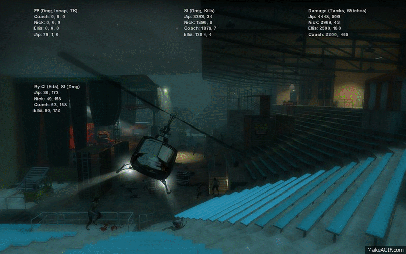

L4D2 Advanced Stats
===================

*L4D2 Advanced Stats is an add-on for Left 4 Dead 2 which displays better stats at map transitions and end games.*

Features
--------

* Single Player, Coop and Realism game modes
* Friendly Fire (damage, incapacitated, team kills)
* Damage done and kills of special infected
* Damage done to Tanks and Witches
* Hits from common infected and damage received from special infected
* Configurable by editing the source files

Install
-------

Download the advstats.vpk file located in the dist folder.

Double-click on the .vpk file to install the add-on. If it does not work, just copy the .vpk in your L4D2 add-ons folder (generally C:\Program Files (x86)\Steam\SteamApps\common\left 4 dead 2\left4dead2\addons)

Launch the game and activate the add-on if not already activated.

Contributing
------------

Feel free to contribute to this project and open pull requests.

Copy these files in a directory placed into your L4D2 add-ons folder (generally C:\Program Files (x86)\Steam\SteamApps\common\left 4 dead 2\left4dead2\addons).

Or execute this command in your L4D2 add-on folder:

```bash
git clone git@github.com:RenaudParis/l4d2-stats.git advstats
```

### Usage

Change these settings at your own convenience:

```squirrel
// scripts/vscripts/main.nut

::ADV_STATS_BOTS_DISPLAY <- false    // Activate the display of bots stats
::ADV_STATS_FF_BOTS_ENABLED <- true  // Activate FF done to bots
::ADV_STATS_EXTRA_STATS <- false     // Activate the display of extra stats
::ADV_STATS_LOG_LEVEL <- 0           // 0 = no debug, 1 = info level, 2 = debug level
::ADV_STATS_DUMP <- false            // Dump stats data at start/end of map
```

Activating extra stats will display headshots done to special infected and hits received from special infected.

### Scripting

* [L4D2 Script functions](https://developer.valvesoftware.com/wiki/List_of_L4D2_Script_Functions)
* [Squirrel documentation](doc/SQUIRREL.md)

Bugs
----

* Damage to Tanks and Witches does not match game-computed values
* Sometimes the event 'incapacitated' happens after only 4 zombie hits (events) instead of five
* When using a survivor mod (e.g. 'Lee' for Coach), the stats do not save for Lee
* Bots are no longer recognized when players use their names (e.g. a player named 'Rochelle')

License
-------

Copyright (c) 2015 RenaudParis.
This content is released under [the MIT license](https://github.com/RenaudParis/l4d2-stats/blob/master/LICENSE).
